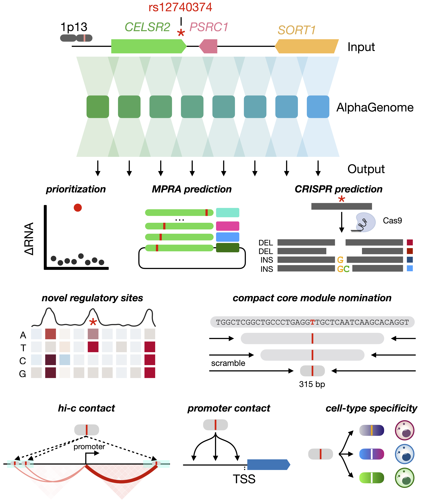

# SORT1 1p13.3 sequence-to-function reanalysis
<p align="center">
  
</p>
  


Analysis code, compact source data, and figure-generation code for a
computational reanalysis of the `SORT1` 1p13.3 cholesterol locus with
AlphaGenome.


## Reproducing from scratch

`reproduce.py` + `reproduction/` is the clean-room capsule: it downloads
every public input fresh and calls the AlphaGenome API fresh for every
prediction, then checksums the result against `outputs/source_data/`.

```bash
conda env create -f environment.yml && conda activate sort1-reanalysis
cp .env.example .env   # add your AlphaGenome API key
python reproduce.py doctor

python reproduce.py run \
  --panels 1B,1C,1D,1E,1F,2B,2C,2E,2F,3A,3B,3C,3E,3F,3G,4B,4C,4E,4F,4G,S1A,S1B,S1C,S1D,S2A,S2B,S2C \
  --run-dir /path/to/run
python reproduce.py compare --run-dir /path/to/run
```

Figures 4H and 4J are large exhaustive AlphaGenome screens (~900K and
~1.6M predictions); 4H is ported (`--panels 4H`) but its full run wasn't
completed, and 4J is scoped but not yet ported. Figures 1A/2A/2D/3D/4A/4D/4I
are author-layout schematics, out of scope for the runner. Supplementary
figures beyond S1/S2 are not yet ported.

## Regenerating figures from existing predictions (fast)

The commands above re-run every AlphaGenome prediction from scratch —
useful for verifying reproducibility, but slow and API-cost-bearing. If
you just want the plots, skip straight to rendering from the compact
tables already checked into `outputs/source_data/` — no API key, no
downloads, seconds instead of hours:

```bash
python figures/fig1.py   # Figure 1C, 1D, 1E, 1F
python figures/fig2.py   # Figure 2B, 2C, 2E, 2F
python figures/fig3.py   # Figure 3E, 3F, 3G
python figures/figS5.py  # Figure S5B, S5C
```

Not every panel has a rendering entry point yet (see `figures/README.md`
for current coverage); those panels' compact tables are still in
`outputs/source_data/` even without a plotting script. For a few panels
(3A, 3F, 4E/4F, 4J, S8D) the full per-position/per-variant prediction
data behind the compact table is too large to commit and lives on Zenodo
instead: [10.5281/zenodo.21820090](https://doi.org/10.5281/zenodo.21820090).

## Layout

- `data/` — provenance (`SOURCES.tsv`) and small curated inputs.
- `reproduction/` + `reproduce.py` — the clean-room runner.
- `figures/` — deterministic rendering from `outputs/source_data/`
  (`figures/fig1.py`, `fig2.py`, `fig3.py`, ...; see `figures/README.md`).
- `outputs/source_data/` — one compact table per panel; checksums in
  `outputs/run_manifests/source_data_sha256.tsv`. A few large derived
  tables (Figures 3A, 3F, 4E/4F, 4J, S8D) are too large to commit and are
  instead deposited on Zenodo (see below and
  `outputs/run_manifests/zenodo_pending_large_outputs.tsv`).
- `manuscript/` — frozen manuscript text and snapshot checksums.
- `MANIFEST.tsv` / `MANIFEST_NOTES.md` — panel-by-panel crosswalk (source
  table, render script, working-archive origin, model regime).

## Validating the release

```bash
python validate.py
```

Checks manifest consistency, source-table checksums, and provenance
notes; exits non-zero on defects. Add `--require-release-assets` for the
strict public-release gate.

## AlphaGenome

Model regime (`ALL_FOLDS` / `FOLD_0`) is recorded per panel in
`MANIFEST.tsv`. Development checkout:
`alphagenome@327ea82371197812b337aed8e9e75df63ce5e429`,
`alphagenome_research@bb6a5276a51199d9589fc8929be6a9d946b7250b`.

## Data, citation, license

Public-data provenance is in `data/SOURCES.tsv`. This code is archived at
Zenodo: [10.5281/zenodo.21819866](https://doi.org/10.5281/zenodo.21819866)
(citation metadata in `CITATION.cff`). Large derived output tables too big
to commit are archived separately: [10.5281/zenodo.21820090](https://doi.org/10.5281/zenodo.21820090)
(file-by-file provenance in `outputs/run_manifests/
zenodo_pending_large_outputs.tsv`). Code is under the license in
`LICENSE`; third-party datasets remain under their own terms.
